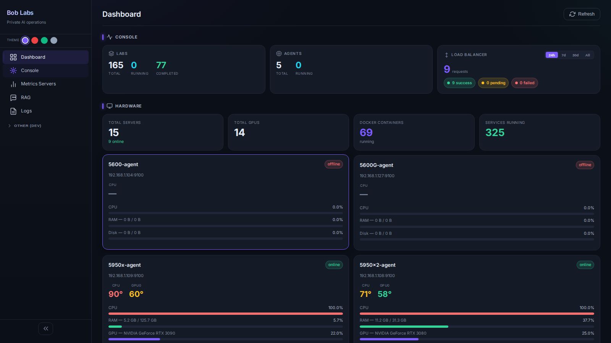
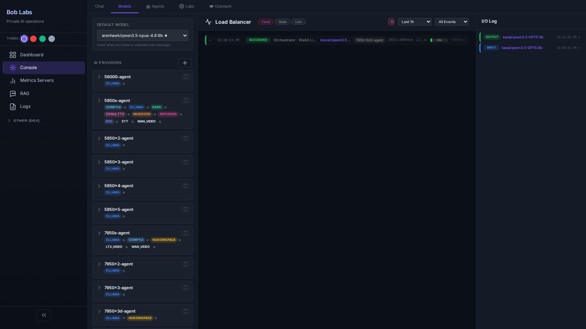
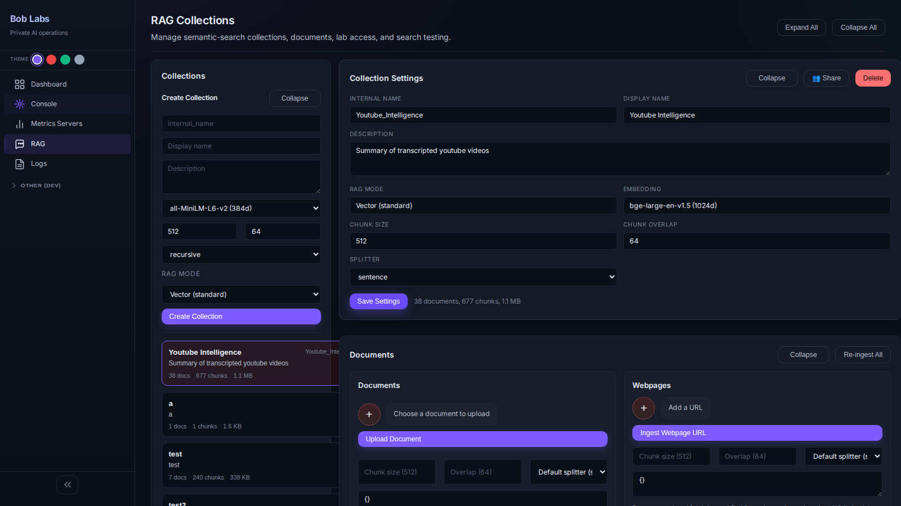
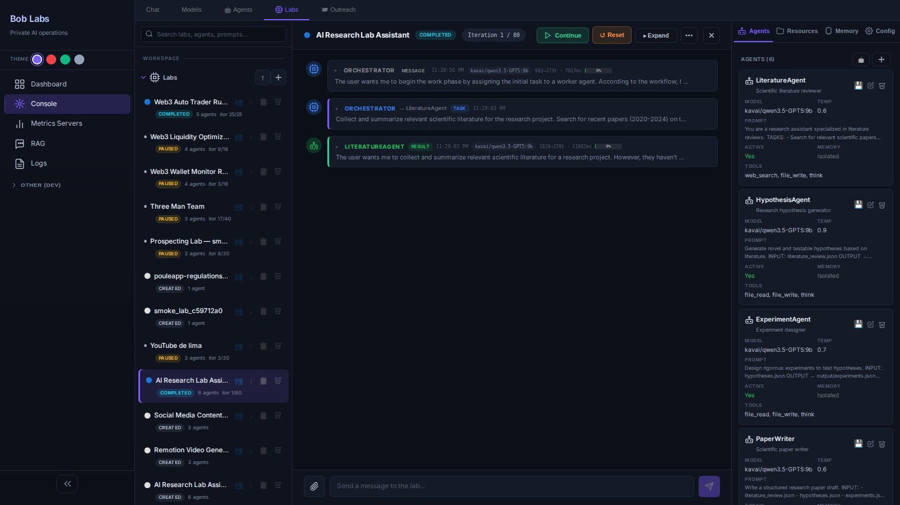

<div align="center">

# Bob Labs

### The full-stack AI agent platform your infrastructure was missing.

**Multi-agent labs · 40 sandboxed tools · private RAG · GPU dispatcher · enterprise auth — all on your servers, in two commands.**

[](LICENSE)
[](docs/INSTALL_PROD.md)
[](docker-compose.yml)
[](control-plane/)
[](frontend/)
[](docker-compose.yml)
[](docs/TOOL_TEST_REPORT.md)

[**Get started**](#quick-start) · [**Live tour**](#a-tour-of-the-platform) · [**Docs**](docs/) · [**Why Bob Labs**](#why-bob-labs)



</div>

---

## What is this

Bob Labs runs **persistent multi-agent workspaces** on your own servers. Each *Lab* is a sandboxed working directory where an Orchestrator coordinates specialist Agents through a shared event bus, calling 40 built-in tools, ingesting private RAG, dispatching GPU jobs, and writing artifacts back to disk. Pause it, resume it, schedule it, ship it as JSON.

It's the missing layer between a chat UI and your infrastructure:

- **Multi-agent without a SaaS**: Orchestrator + N agents, each with their own model, prompt, memory, and tool grants. They talk through a typed message bus, not through your prompts.
- **Sandboxed by default**: every code/shell call runs in a per-Lab container with command allow-lists and resource caps. The agent can't `curl evil.com` unless you said it could.
- **Total privacy**: PostgreSQL, Qdrant, Ollama/vLLM — all on your hardware. No third-party tokens leak through, ever.
- **Full infra handling for self-hosted models**: a GPU dispatcher auto-discovers your fleet (1 to N machines), routes models to the right card, hot-swaps loads, and gives you a live load-balancer feed.
- **Enterprise grade**: JWT auth, role-based access, per-lab ACL (owner/editors/viewers), admin panel, audit logs, time-limited access tokens.

If you've ever tried to give an LLM access to your stack and walked away cold, this is the thing.

---

## A tour of the platform

<table>
  <tr>
    <td width="50%" align="center">
      <b>Lab Dashboard</b><br/>
      <sub>Servers, GPUs, projects, RAG, news — one screen.</sub><br/>
      
    </td>
    <td width="50%" align="center">
      <b>Orchestrator + Live Activity Feed</b><br/>
      <sub>Chat, agent picker, model router, real-time event stream.</sub><br/>
      
    </td>
  </tr>
  <tr>
    <td width="50%" align="center">
      <b>Private RAG</b><br/>
      <sub>Qdrant + LightRAG. Per-collection access control. PDF/MD/HTML ingest.</sub><br/>
      
    </td>
    <td width="50%" align="center">
      <b>Inside a Lab</b><br/>
      <sub>Orchestrator + N agents, shared timeline, live message bus, per-agent state.</sub><br/>
      
    </td>
  </tr>
</table>

---

## Why Bob Labs

|  | LangChain Apps | Open WebUI | Bob Labs |
|---|:---:|:---:|:---:|
| Self-hosted, no SaaS calls | depends on tools | yes | **yes** |
| Multi-agent orchestration |  glue code | no | **first-class** |
| Persistent labs (pause/resume/schedule) | no | no | **yes** |
| Sandboxed code/shell execution | bring-your-own | no | **per-lab containers** |
| Built-in tools (no plugin install) | bring-your-own | partial | **40 in the box** |
| GPU dispatcher across N hosts | no | no | **yes** |
| Private RAG (Qdrant + LightRAG) | bring-your-own | partial | **yes** |
| Per-resource ACL (owner/editors/viewers) | no | partial | **yes** |
| Two-command deploy | no | yes | **yes** |
| Open source | varies | yes | **Apache 2.0** |

---

## Quick start

```bash
git clone https://github.com/boblabs-eu/boblabs.git
cd bob-manager
cp .env.example .env          # fill JWT_SECRET, ADMIN_SECRET, ADMIN_EMAIL
docker compose up -d --build
```

That's it.

| Service | URL |
|---|---|
| Dashboard | http://localhost:3000 |
| API + Swagger | http://localhost:8888/docs |

Need GPU services on a remote box? `cd agent && sudo bash install.sh` on each GPU host. The agent auto-registers and starts streaming metrics back. No Kubernetes. No SaaS. No waiting list.

Production-grade hardening (TLS, secrets management, hardened compose) is documented in [INSTALL_PROD.md](docs/INSTALL_PROD.md).

---

## What's inside

### 🧪 Multi-agent Labs
Persistent workspaces with an Orchestrator + N Agents. Each agent has its own system prompt, model, memory, and tool grants. Pause-resume-stop. Pluggable loop strategies (Plan-Execute, Critique-Refine, Round-Robin, custom). Anti-loop detector catches semantic and tool-call repetition. Import/export labs as versionable JSON. [LABS.md](docs/LABS.md)

### 🛠️ 40 sandboxed tools
Auto-discovered from `tool_*.py`. Code (`python_exec`, `shell_exec`), files (`file_read`, `file_write`), web (`web_search`, `web_extract`, `browser_navigate`, `browser_snapshot`, `excalidraw`, `mermaid_to_img`), media (`image_generate`, `audio_generate`, `video_generate`, `audio_mix`, `media_pipeline`, `comfyui`), comms (`mail`, `twitter`, `media_post`, `postiz`), data (`youtube`, `gouv_data_fr`, `blockchain`, `defi_data`, `web3_portfolio`, `trading`, `trustless_otc`), database (`db_query`, `db_execute`, `db_schema`), RAG (`rag_search`, `rag_ingest`, `rag_list_collections`), memory (`memory_save`, `memory_search`, `handle_memory`), reasoning (`think`), ops (`control_server`, `clock`, `call_agent`). All sandboxed, all auditable. [TOOLS_AND_SANDBOX.md](docs/TOOLS_AND_SANDBOX.md)

### 🔒 Private RAG
Qdrant for vectors + LightRAG for graph-enhanced retrieval. Per-collection access control. Ingest PDF, Markdown, HTML, plain text, web URLs. Query in `local`, `global`, or `hybrid` mode. The agent gets a tool, you keep the data. [RAG.md](docs/RAG.md) · [LIGHTRAG.md](docs/LIGHTRAG.md)

### ⚡ GPU dispatcher across N hosts
Auto-discovers agents, routes inference to the least-loaded provider, retries on failure, hot-swaps Ollama models without dropping requests. Live load-balancer feed shows every dispatch in real time. [DISPATCHER_AND_MODEL_ROUTING.md](docs/DISPATCHER_AND_MODEL_ROUTING.md)

### 🎨 Self-hosted media generation
Nine GPU microservices, each in its own compose file, mix and match per host:

| Service | What | Default port |
|---|---|---|
| MusicGen | Text → music (small/medium/large/melody) | 3014 |
| Bark | TTS, singing | 3015 |
| RVC | Voice conversion | 3016 |
| CoquiTTS | TTS + voice cloning (XTTS v2) | 3017 |
| STT | Speech-to-text (Whisper) | 7865 |
| LTX-Video | Text/image → video (LTX-2.3, 22B DiT) | 3018 |
| Wan-Video | Text/image → video (Wan 2.2, 5B) | 3019 |
| Remotion | React → MP4 programmatic video | 3020 |
| ComfyUI bridge | SDXL / Flux / SD3 workflows | varies |

[GPU_SERVICES.md](docs/GPU_SERVICES.md) · [MUSIC_PIPELINES.md](docs/MUSIC_PIPELINES.md)

### 🛡️ Enterprise auth & admin
JWT tokens (1-day default). Role-based access (admin / user). Per-resource ACL on labs, projects, RAG collections, wallets — `{owner, editors, viewers}` keyed by email, enforced in SQL. Time-limited access tokens managed from an admin panel — invite users by email, revoke with one click. Full audit log of every request. [ACCESS_CONTROL.md](docs/ACCESS_CONTROL.md)

### 🔌 Any model, any provider
First-class adapters for Ollama, vLLM, HuggingFace, OpenAI, Anthropic, xAI, Groq, DeepSeek. Mix local + API in the same lab; the dispatcher fails over automatically. [DISPATCHER_AND_MODEL_ROUTING.md](docs/DISPATCHER_AND_MODEL_ROUTING.md)

### 📡 Real-time event bus
Every agent decision, tool call, and inter-agent message is broadcast over a WebSocket. Plug it into a dashboard, a CLI, a Discord bot — it's just JSON.

### 🪙 Web3 lane
Wallet tracking, portfolio history, on-chain queries (EVM + Solana via Blockscout), DeFi data (CoinGecko / DeFiLlama / DEX Screener), an agent-callable trading tool with policy guards, and a TrustlessOTC P2P bridge. [WEB3_TOOL.md](docs/WEB3_TOOL.md)

### 🧰 Operations toolbelt
Server fleet management, real-time CPU/RAM/GPU/disk/network metrics, remote command execution, multi-step YAML workflows, project tracking, resource library, news/RSS aggregation, blog publisher.

---

## How a Lab actually runs

```
   ┌────────────────────────────────────────────────────────────────┐
   │                    Lab : "Daily research brief"                │
   │                                                                │
   │   ┌─────────────┐    plan      ┌────────────┐                  │
   │   │ Orchestrator│─────────────▶│  Agent A   │ web_search       │
   │   │ (qwen 14B)  │              │ Researcher │ web_extract      │
   │   └──────┬──────┘              └─────┬──────┘ rag_search       │
   │          │                           │                         │
   │          │   results               ┌─┴────────┐                │
   │          ▼                         │  Agent B │ python_exec    │
   │   ┌─────────────┐                  │ Analyst  │ file_write     │
   │   │  shared     │◀─────────────────┴──────────┘                │
   │   │  workspace  │      memory + artifacts                      │
   │   │  /data/lab/ │                                              │
   │   └─────────────┘                                              │
   │                                                                │
   │  ◉ event bus  ◉ pause/resume  ◉ ACL  ◉ JSON export             │
   └────────────────────────────────────────────────────────────────┘
                              │
            ┌─────────────────┼──────────────────┐
            ▼                 ▼                  ▼
       ┌─────────┐      ┌──────────┐       ┌──────────┐
       │ bob-api │      │ Sandbox  │       │ GPU host │
       │ (FastAPI)│     │ container│       │ (Ollama, │
       │         │      │ per-lab  │       │  vLLM,…) │
       └─────────┘      └──────────┘       └──────────┘
```

The Orchestrator owns the loop. Agents are stateless turn-takers. The workspace is where artifacts land. Tool calls are the only side effects, and they're all gated.

[ARCHITECTURE.md](docs/ARCHITECTURE.md) for the full picture (database schema, websocket protocol, agent execution model).

---

## Use cases (real labs people run)

- **Daily research brief** — Orchestrator dispatches three specialist desks (competitive, market signals, customer voice) in parallel; an Editor agent writes the final HTML/MD digest.
- **Code-base archaeologist** — Ingest a repo into RAG, ask questions, generate refactoring plans, write the patches.
- **Crypto desk** — Watch wallets, evaluate predictions, draft trades — with read-only or signed-tx tool grants.
- **Voice/video pipeline** — One Lab takes a topic, drafts a script, generates audio (Bark), generates a video (Wan-Video), uploads to YouTube.
- **Internal tools backend** — Build a private app on top of bob-api; consumer apps register via the admin panel and call bob-api with HMAC-signed requests.

Lab definitions are versioned JSON in [`templates/lab_examples/`](templates/lab_examples/). Drop one in, hit run.

---

## Documentation map

> **35 docs, ~12k lines.** Auto-tested smoke gate documented at [TOOL_TEST_REPORT.md](docs/TOOL_TEST_REPORT.md).

| | |
|---|---|
| **Get oriented** | [GENERAL_OVERVIEW](docs/GENERAL_OVERVIEW.md) · [ARCHITECTURE](docs/ARCHITECTURE.md) · [QUICK_LAUNCH](docs/QUICK_LAUNCH.md) |
| **Build a lab** | [LABS](docs/LABS.md) · [AGENTS_AND_ORCHESTRATION](docs/AGENTS_AND_ORCHESTRATION.md) · [PROMPT_STRUCTURE](docs/PROMPT_STRUCTURE.md) · [ANTI_LOOP](docs/ANTI_LOOP.md) |
| **Tools & sandbox** | [TOOLS_AND_SANDBOX](docs/TOOLS_AND_SANDBOX.md) · [WEB3_TOOL](docs/WEB3_TOOL.md) |
| **RAG** | [RAG](docs/RAG.md) · [LIGHTRAG](docs/LIGHTRAG.md) |
| **Models & GPUs** | [DISPATCHER_AND_MODEL_ROUTING](docs/DISPATCHER_AND_MODEL_ROUTING.md) · [GPU_SERVICES](docs/GPU_SERVICES.md) · [MUSIC_PIPELINES](docs/MUSIC_PIPELINES.md) |
| **Auth & ops** | [ACCESS_CONTROL](docs/ACCESS_CONTROL.md) · [API_REFERENCE](docs/API_REFERENCE.md) · [SCHEDULING_AND_CRON](docs/SCHEDULING_AND_CRON.md) |
| **Run it in prod** | [INSTALL_PROD](docs/INSTALL_PROD.md) · [CONFIGURATION](docs/CONFIGURATION.md) · [AGENT](docs/AGENT.md) · [CONSUMER_APPS](docs/CONSUMER_APPS.md) |

---

## Stack

| Layer | Choice |
|---|---|
| API | FastAPI · Python 3.12 · SQLAlchemy 2 (async) · Pydantic v2 |
| DB | PostgreSQL 16 · JSONB ACL columns · single-file schema (`init.sql`) |
| Vectors | Qdrant 1.12 · LightRAG (graph-enhanced) |
| UI | React 18 · React Router v6 · Recharts · WebSocket |
| GPU services | PyTorch · CUDA 12.1 · AudioCraft · Bark · XTTS · Whisper · Remotion · LTX-Video · Wan-Video |
| Models | Ollama · vLLM · HuggingFace · OpenAI · Anthropic · xAI · Groq · DeepSeek |
| Auth | JWT (HS256) · per-resource ACL · admin-managed access tokens |
| Ops | Docker Compose · structured request log · admin observability dashboard |

---

## Project layout

```
bob-manager/
├── control-plane/    FastAPI backend (api, services, models, repos, websocket, engine)
├── agent/            Python agent for GPU servers (collectors, inspectors, executor, ws)
├── frontend/         React 18 SPA (pages, components, services)
├── sandbox/          Per-lab isolated execution container
├── remotion-api/     React → MP4 video rendering service
├── script-runner/    GPU script discovery & execution
├── gpu-services/     Standalone GPU microservices (musicgen, bark, rvc, coqui-tts, stt, ltx-video, wan-video)
├── templates/        Agent presets + lab blueprint examples (JSON)
├── scripts/          Tooling (smoke tests, deep tests, publish)
└── docs/             35 docs, ~12k lines
```

---

## Status

- ✅ All 40 built-in tools pass the smoke gate. See [TOOL_TEST_REPORT.md](docs/TOOL_TEST_REPORT.md).
- ✅ Two-command deploy from a fresh clone.
- ✅ Used in production by the maintainers (this is real software, not a slide deck).
- 🧪 Public release fresh out the door — please file issues, even small ones. Some features still in development.

---

## License

[Apache License 2.0](LICENSE) — use it, fork it, ship it. See [`NOTICE`](NOTICE) for attribution and [`CITATIONS.md`](CITATIONS.md) for upstream model and library credits.

Third-party components (LightRAG, Qdrant, Ollama, vLLM, ComfyUI, Remotion, Bark, XTTS, MusicGen, RVC, LTX-Video, Wan-Video, Riffusion, …) keep their own licenses.

---

<div align="center">
<sub>Built by people tired of pasting API keys into web forms.</sub><br/>
<sub><b>Star</b> if this saved you a weekend.</sub>
</div>
